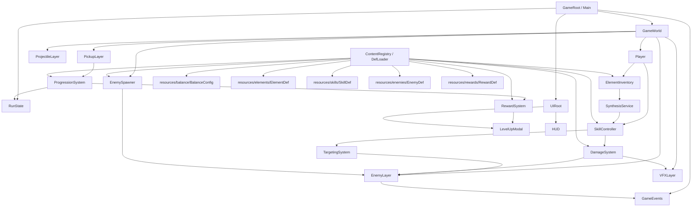

# Godot Prototype Architecture

最后更新：2026-04-25

本文描述 Game1 的 Godot 4 原型程序架构。它是工程实现前置材料，不创建固定 v0 原型协议；engineering agent 可以基于任何明确的原型任务开工，但应遵守这里定义的系统边界、数据流和资源接入规则。

## 架构目标

- 使用 Godot 4 + GDScript 2.0。
- 支持 2D top-down 连续生存玩法。
- 支持玩家移动走位、怪物无限刷出、经验拾取、升级暂停奖励。
- 支持冰 / 火 / 雷基础元素、自动 CD 技能、元素槽、元素强化和后续合成扩展。
- 保持技能、怪物、奖励、数值和资源表现可替换，避免把一次原型写死成长期架构。
- 保持模块功能边界清晰，避免一次小改动牵连多个系统。
- 对技能、元素、怪物、奖励、数值和资源路径使用 single source of truth，其他系统只引用或查询，不各自维护副本。
- 运行时资源只引用 Godot 工程内 `assets/`，不直接依赖 `skills/`、`tmp/`、`.codex/` 或绝对路径。当前 Godot 工程根目录是 `godotGame/`。

## 目录结构

Godot 工程位于仓库内 `godotGame/`，默认使用以下结构：

```text
godotGame/
  project.godot
  scenes/
    main/
    game/
    player/
    enemy/
    combat/
    pickups/
    ui/
  scripts/
    autoload/
    combat/
    enemies/
    progression/
    rewards/
    skills/
    spawning/
    ui/
    utils/
  resources/
    balance/
    elements/
    enemies/
    rewards/
    skills/
  assets/
    art/
      icons/
      sprites/
      vfx/
      ui/
    audio/
  addons/
  tests/
```

`skills/elemental-art-assets/assets/game-ready/` 是制作和交接资源的来源目录，不是游戏运行时目录。接入 Godot 时，应把已确认资源复制到 `godotGame/assets/art/` 下。

## 场景结构

- `Main`：游戏入口，负责启动一局游戏、挂载 `GameWorld` 和 `UIRoot`。
- `GameWorld`：战斗根节点，负责组织玩家、敌人、投射物、拾取物和 VFX 层。
- `Player`：移动、碰撞、生命、经验拾取范围、技能挂载点。
- `Enemy`：追踪移动、生命、接触伤害、死亡掉落 XP。
- `Projectile` / `AreaEffect`：技能命中载体，表现投射物、范围爆发、持续区域或 aura。
- `XpShard`：经验拾取物，进入玩家拾取范围后通知 progression。
- `HUD`：显示生命、等级、经验、元素槽和基础状态。
- `LevelUpModal`：升级暂停后的 3 选 1 奖励界面。

## 架构示意图



## 模块边界与 Single Source of Truth

本架构的核心标准是：静态定义集中，运行状态集中，表现引用集中。系统之间通过 ID、事件或明确接口协作，不在多个地方重复维护同一份定义。

### 静态定义来源

- 技能定义只来自 `resources/skills/SkillDef`。技能 id、元素配方、品质、冷却、伤害 profile、目标选择、表现类型、图标和 VFX 引用都以这里为准。
- 元素定义只来自 `resources/elements/ElementDef`。元素 id、显示名、元素类型、图标和默认基础技能都以这里为准。
- 敌人定义只来自 `resources/enemies/EnemyDef`。敌人 id、HP 倍率、速度倍率、伤害倍率、XP 倍率和场景引用都以这里为准。
- 奖励定义只来自 `resources/rewards/RewardDef`。奖励类型、权重、前置条件、展示资源和应用入口都以这里为准。
- 全局数值基准只来自 `resources/balance/BalanceConfig`。伤害、HP、刷怪、经验和成长公式需要的基准值不散落在各系统脚本中。
- Godot 运行时美术资源只来自 `godotGame/assets/`。art skill、生成脚本、source notes 和 manifest 是制作交接资料，不是运行时事实源。

### 运行状态来源

- 一局游戏内的可变状态只写入 `RunState` 或明确归属的运行时节点。
- `RunState` 保存当前时间、等级、经验、元素槽、符文、奖励状态和暂停状态。
- `RunState` 不复制 `SkillDef`、`ElementDef`、`EnemyDef` 或 `RewardDef` 的静态字段；需要静态信息时通过 ID 查询 `ContentRegistry / DefLoader`。
- `Enemy`、`Projectile`、`XpShard` 等场景实例只保存自身运行时状态，例如当前 HP、当前位置、已存在时间和当前目标。

### 读取和引用规则

- UI 展示技能名、图标、说明和数值预览时，从 `SkillDef`、`ElementDef`、`RewardDef` 和 `BalanceConfig` 组合读取，不在 UI 脚本里手写另一份技能说明。
- `RewardSystem` 可以引用技能、元素或符文的 ID，但不复制它们的完整定义。
- `SkillController` 可以缓存当前装备技能的运行时实例状态，例如 CD 剩余时间，但不复制技能基础参数。
- `DamageSystem` 负责把 `SkillDef`、`BalanceConfig`、元素等级和运行时加成组合成最终伤害；其他系统不重复实现伤害公式。
- `EnemySpawner` 只根据 `EnemyDef` 和 `BalanceConfig` 生成敌人，不在刷怪逻辑里另写敌人 HP / 速度表。
- `ProgressionSystem` 只根据 `BalanceConfig` 计算经验阈值，不在 UI 或奖励系统里重复计算升级公式。

### 禁止的重复定义

- 不在 `SkillController`、`LevelUpModal`、`HUD` 和奖励配置里分别写同一个技能的名称、伤害、冷却或说明。
- 不在敌人场景、刷怪器和数值配置中分别维护敌人血量表。
- 不在多个脚本中分别 hardcode 元素 id 字符串集合；需要枚举时从元素定义或集中常量读取。
- 不让 `skills/elemental-art-assets/`、`asset_manifest.json` 或临时生成目录成为 Godot 运行时依赖。

### ContentRegistry / DefLoader

`ContentRegistry / DefLoader` 是后续实现时建议加入的轻量数据读取入口。它不负责游戏规则，只负责加载和查询定义：

- `get_skill_def(skill_id)`
- `get_element_def(element_id)`
- `get_enemy_def(enemy_id)`
- `get_reward_def(reward_id)`
- `get_balance_config()`

这样做的目的不是增加复杂度，而是避免每个系统自己扫描 `resources/` 或维护局部缓存。原型阶段可以用简单 autoload、单例脚本或明确传参实现；关键是对外保持同一个读取入口。

## 核心系统

### RunState

保存一局游戏的运行状态：

- 当前游戏时间。
- 玩家等级、经验和升级阈值。
- 当前元素槽。
- 当前符文和奖励状态。
- 暂停 / 奖励选择等局内状态。

`RunState` 不负责生成奖励、不负责刷怪、不负责造成伤害，只保存状态并提供必要查询。

`RunState` 只保存运行时变化，不保存静态定义副本。元素槽可以保存元素 / 技能 / 符文 ID 和运行时等级，显示名、图标、基础参数等仍从对应 Def 查询。

### GameEvents

集中跨系统信号，减少节点之间直接互相查找：

- `enemy_died`
- `xp_collected`
- `level_up_requested`
- `reward_selected`
- `player_damaged`
- `skill_cast_requested`

### SkillController

管理玩家当前技能：

- 读取 `SkillDef`。
- 处理技能 CD。
- 调用 `TargetingSystem` 获取目标。
- 生成 `Projectile`、`AreaEffect` 或 aura 节点。
- 将伤害参数交给 `DamageSystem`。

技能释放逻辑不直接处理升级、奖励、刷怪或 UI。

`SkillController` 只维护技能运行时状态，例如当前装备列表、CD 剩余时间、临时 buff，不维护技能定义表。技能定义表只来自 `SkillDef`。

### TargetingSystem

提供可替换目标选择策略：

- 最近敌人。
- 玩家周围随机点。
- 玩家当前位置。
- 技能自身运动逻辑。

原型阶段先实现少量策略，接口保留扩展空间。

### DamageSystem

统一处理伤害和轻量控制效果：

- 根据 `BalanceConfig`、`SkillDef` 和元素等级计算伤害。
- 应用减速、短麻痹、短冻结等状态。
- 发出命中事件和 VFX 请求。

设计文档中的 `BASE_DPS`、`expected_hit_count`、`profile_multiplier` 等公式应能映射到此系统。

伤害公式只在 `DamageSystem` 中实现。其他系统需要显示预估伤害时，应调用同一套计算方法或读取同一套计算结果，不重新写一份公式。

### EnemySpawner

负责连续刷怪压力：

- 根据当前时间和玩家等级计算 `spawn_rate`。
- 根据当前时间和玩家等级计算 `max_alive`。
- 按 `EnemyDef` 生成普通追踪怪、小型快怪、厚血怪等敌人。

刷怪系统只决定“何时刷、刷什么、刷在哪里”，不维护另一份敌人数值定义。

### ProgressionSystem

负责经验和升级：

- 接收 XP 收集事件。
- 使用 `XP_BASE` 和 `XP_GROWTH` 计算升级阈值。
- 触发升级暂停。
- 请求 `RewardSystem` 生成 3 选 1。

### RewardSystem

负责奖励生成和应用：

- 生成新元素、元素强化、符文类奖励。
- 控制奖励权重和候选过滤。
- 应用用户选择结果。

奖励界面只负责展示和选择，不直接修改核心状态。

奖励系统引用 `RewardDef`、`ElementDef`、`SkillDef` 和 `BalanceConfig`，不复制技能、元素或数值说明。奖励被选择后，通过明确的应用入口修改 `RunState` 或对应系统。

### ElementInventory

管理 3 个元素槽：

- 基础元素：冰、火、雷。
- 高级元素、紫色品质、橙色品质。
- 元素等级和强化。
- 当前符文激活计算所需的元素总数。

### SynthesisService

预留元素合成接口：

- 检查当前元素槽是否满足配方。
- 返回可合成结果。
- 执行基础 / 高级 / 紫色阶段合成。

合成 UI 的具体交互仍未确定，所以该系统只定义程序边界，不替设计做 UI 决策。

## 数据资源

### BalanceConfig

集中保存数值基准：

- `BASE_DPS`
- `TARGET_TTK`
- `ENEMY_HP_BASE`
- `TIME_GROWTH`
- `LEVEL_GROWTH`
- `ELEMENT_LEVEL_BONUS`
- `CONTACT_DAMAGE_BASE`
- `SPAWN_RATE_BASE`
- `MAX_ALIVE_BASE`
- `MAX_ALIVE_CAP`
- `XP_BASE`
- `XP_GROWTH`
- `XP_DROP_BASE`

### ElementDef

描述元素：

- `id`
- 显示名。
- 元素类型：ice / fire / lightning。
- 图标资源。
- 默认基础技能。

### SkillDef

描述技能：

- `id`
- 元素配方。
- 品质。
- 冷却时间。
- 伤害 profile。
- 目标选择模式。
- 期望命中次数或 tick 次数。
- projectile / area / aura 表现类型。
- 图标和 VFX 资源引用。

### EnemyDef

描述敌人：

- `id`
- HP 倍率。
- 速度倍率。
- 接触伤害倍率。
- XP 倍率。
- 场景资源引用。

### RewardDef

描述奖励：

- `id`
- 奖励类型：new_element / element_upgrade / rune。
- 权重。
- 前置条件。
- 展示图标和文本。
- 应用效果入口。

## 资源接入原则

- 已确认 art skill 资源接入 Godot 前，复制到 `godotGame/assets/art/`。
- 运行时不引用 `skills/elemental-art-assets/`。
- 图标建议进入 `godotGame/assets/art/icons/`。
- VFX spritesheet 建议进入 `godotGame/assets/art/vfx/`。
- 接入 VFX 前必须确认帧宽高、帧数、FPS、是否循环。
- 未经用户确认的资源不得作为最终资源接入。

## 架构待定接口

架构文档不追踪具体未完成的游戏内容。未完成技能、符文效果池、品质具体效果等内容设计，以 `docs/design/current-design.md`、`docs/design/memory.md` 和 `docs/agent/task-board.md` 为准。

本节只记录会影响程序边界的开放点：

- 合成入口：无论最终是升级奖励中合成、独立按钮合成，还是其他交互，程序上都通过 `SynthesisService` 检查配方并返回可执行结果。
- 奖励应用：无论奖励池最终如何设计，程序上都通过 `RewardSystem` 生成候选，并通过明确应用入口修改 `RunState` 或对应系统。
- 品质扩展：无论高级 / 紫色 / 橙色最终是纯数值变化还是形态变化，`SkillDef` 都需要支持品质、表现类型、资源引用和可选行为 profile。
- 符文扩展：无论符文具体效果如何，运行时只保存符文 ID 和激活状态；具体定义应通过后续 `RuneDef` 或等价数据源集中管理。

如果实现任务碰到会改变这些程序边界的问题，engineering agent 应记录问题并交给 design agent 或用户确认，而不是用代码默认值悄悄决定。
